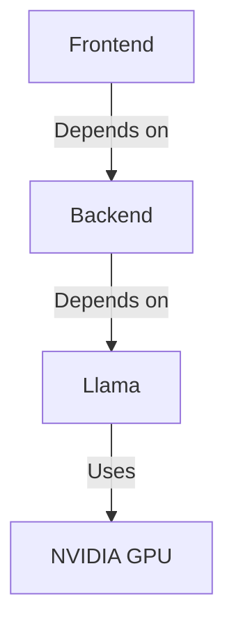
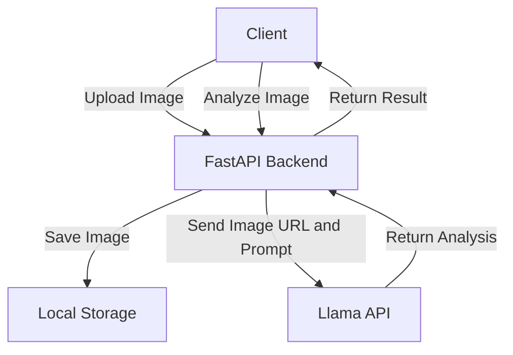
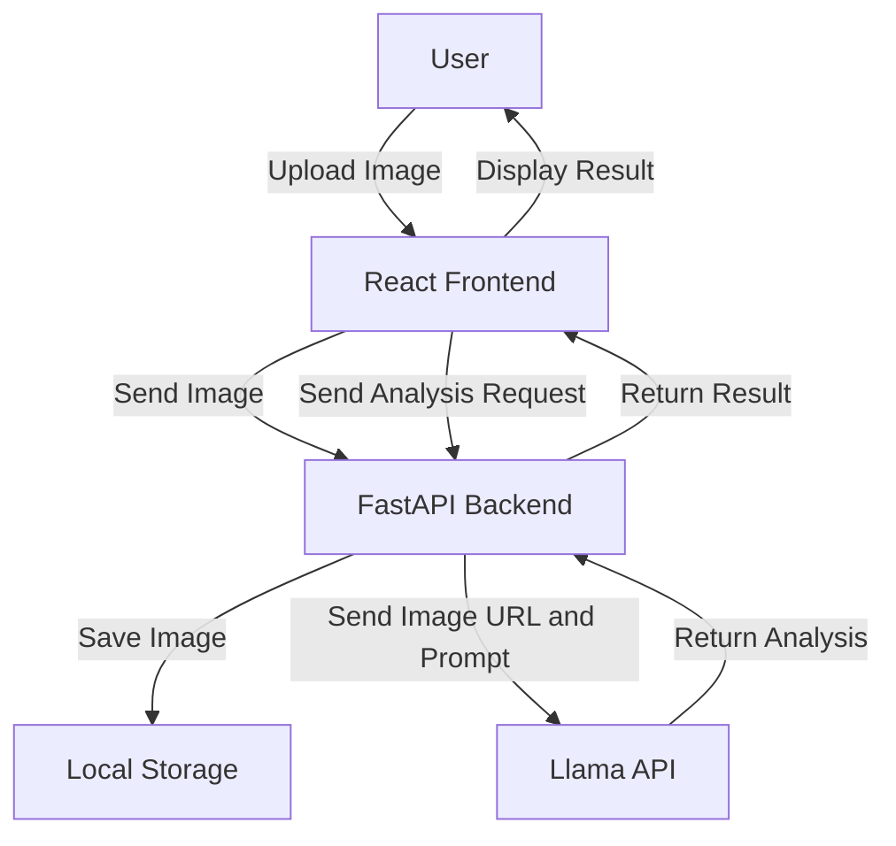

# Llama Vision Project

The Llama Vision Project is designed to analyze images using a backend service powered by FastAPI and a frontend built with React. The backend handles image uploads and analysis requests, while the frontend provides a user interface for uploading images and displaying analysis results. The project uses Docker Compose to manage the services and dependencies.

## Project Structure

```
llama-vision-project/
├── backend/
│   ├── app.py
│   ├── Dockerfile
│   ├── requirements.txt
│   └── uploads/
├── frontend/
│   ├── public/
│   │   ├── index.html
│   │   ├── favicon.ico
│   │   ├── manifest.json
│   │   └── robots.txt
│   ├── src/
│   │   ├── App.js
│   │   └── index.js
│   ├── Dockerfile
│   ├── package.json
│   └── ...
├── docker-compose.yml
└── README.md
```

## Setup

### Prerequisites

- Docker
- Docker Compose

### Installation

1. Clone the repository:

   ```sh
   git clone https://github.com/bniladridas/llama-vision-project.git
   cd llama-vision-project
   ```

2. Build and start the services:

   ```sh
   docker compose up --build
   ```

3. Access the frontend application at `http://localhost:3000`.

## Usage

1. Open the frontend application in your browser.
2. Upload an image using the "Choose Image" button.
3. Enter a prompt to describe the image.
4. Click the "Analyze Image" button to analyze the image.
5. View the analysis result displayed on the page.

## Resolving NVIDIA GPU Driver Issue

The error message indicates that the Docker daemon could not select the NVIDIA device driver with GPU capabilities. This is likely because your host platform does not support NVIDIA GPUs or the necessary drivers are not installed.

To resolve this issue, you can either:

### Option 1: Remove the GPU Requirement

Update the `docker-compose.yml` file to remove the GPU requirement.

```dockercompose
services:
  llama:
    image: nvcr.io/nim/meta/llama-3.2-90b-vision-instruct:latest
    environment:
      - NGC_API_KEY=${NGC_API_KEY}
    volumes:
      - ${LOCAL_NIM_CACHE:-~/.cache/nim}:/opt/nim/.cache
    ports:
      - "8000:8000"
    shm_size: '16gb'

  backend:
    build: 
      context: ./backend
      dockerfile: Dockerfile
    ports:
      - "8001:8001"
    volumes:
      - ./backend/uploads:/app/uploads
    depends_on:
      - llama
    environment:
      - LLAMA_API_URL=http://llama:8000/v1/chat/completions

  frontend:
    build:
      context: ./frontend
      dockerfile: Dockerfile
    ports:
      - "3000:3000"
    depends_on:
      - backend
    volumes:
      - ./frontend:/app
    environment:
      - NODE_ENV=development
      - REACT_APP_BACKEND_URL=http://localhost:8001
```

### Option 2: Ensure Your Host Platform Supports NVIDIA GPUs

If you need GPU capabilities, ensure that your host platform supports NVIDIA GPUs and the necessary drivers are installed. You can follow the instructions provided by NVIDIA to install the drivers and set up Docker with GPU support: [NVIDIA Docker Documentation](https://docs.nvidia.com/datacenter/cloud-native/container-toolkit/install-guide.html).

After making the necessary changes, run the following commands to rebuild the Docker images:

```sh
docker compose down
docker compose up --build
```

## Diagrams

### Docker Compose Services



### Backend Service



### Frontend Application



## Current State

The project is set up to analyze images using a pre-trained model. The backend service handles image uploads and analysis requests, while the frontend provides a user interface for uploading images and displaying analysis results. The project is containerized using Docker and managed with Docker Compose.

## Contributing

Contributions are welcome! Please open an issue or submit a pull request for any improvements or bug fixes.

## License

This project is licensed under the MIT License. See the [LICENSE](LICENSE) file for details.